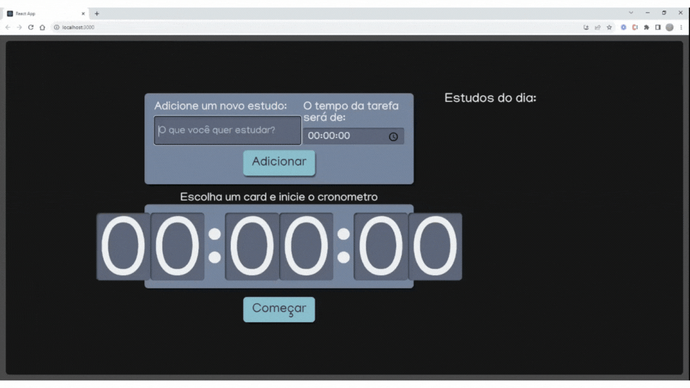

# ToDoList em React

O ToDoList em React é uma aplicação de lista de tarefas simples e intuitiva construída utilizando o framework React. Permite aos usuários adicionar, remover e marcar tarefas como completas.

### Funcionalidades

- Adicionar novas tarefas (timer).
- Marcar tarefas como concluídas.
- Remover tarefas.

### Demonstração



### Pré-requisitos

Antes de começar a utilizar o ToDoList em React, verifique se você possui os seguintes pré-requisitos:

- Node.js e npm instalados.

### Como usar

Navegue até o diretório em que deseje salvar o projeto:
```bash
cd Desktop
```

Clone o repositório:
```bash
git clone https://github.com/Sergioadjr/Digix-studies.git
```

### Execute o aplicativo:

Abra [http://localhost:3000](http://localhost:3000) para visualizar no seu browser.
Clone o repositório:
```bash
npm start
```
